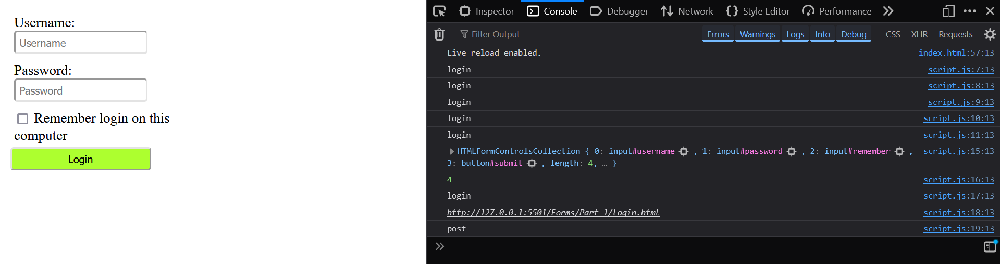
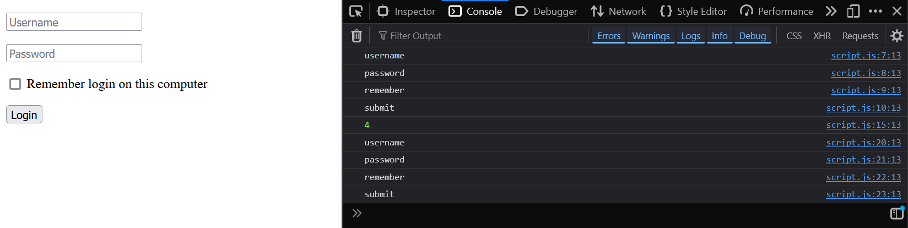
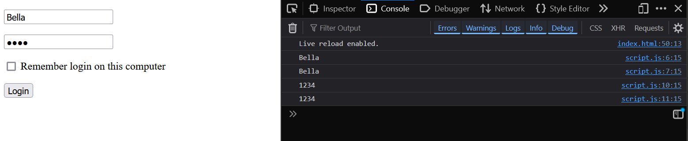
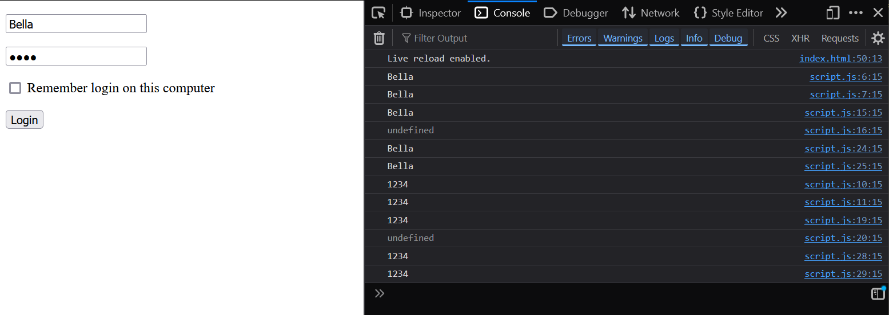
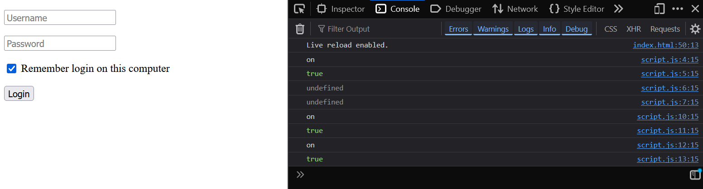
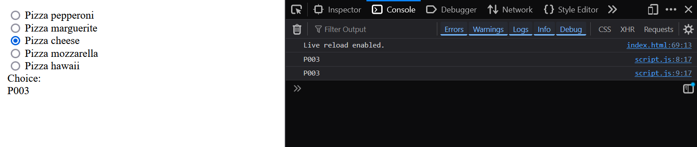
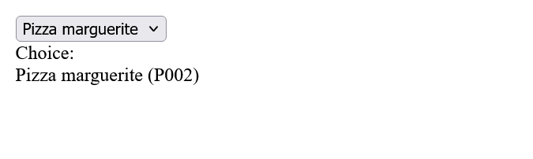
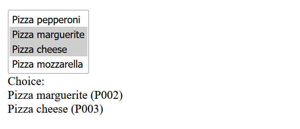
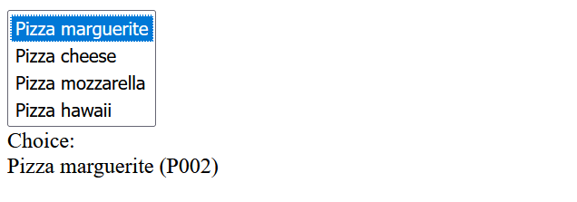
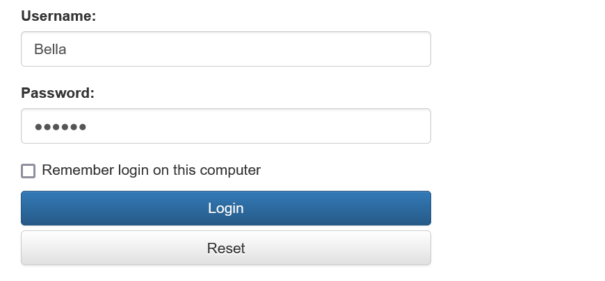

# Forms_in_JavaScript
 Forms with JavaScript


## Accessing forms and form fields

### Access to forms - [Part_1](https://github.com/BellaMrx/Forms_in_JavaScript/tree/main/Forms/Part_1)

#### Explanation:
This example shows the various options for accessing forms on a website.

  ```
    <form id="login" name="login" method="post" action="login.html">
      <div class="form-group">
        <label for="username">Username:</label>
        <br>
        <input type="text" id="username" name="username" value="" placeholder="Username">
      </div>
      <div class="form-group">
        <label for="password">Password:</label>
        <br>
        <input type="password" id="password" name="password" value="" placeholder="Password">
      </div>
      <div class="checkbox">
        <label for="remember">
          <input type="checkbox" id="remember" name="remember" value="on">
          Remember login on this computer
        </label>
      </div>
      <button type="submit" id="submit" name="submit">Login</button>
    </form>
  ```

The HTML code ([index.html](https://github.com/BellaMrx/Forms_in_JavaScript/blob/main/Forms/Part_1/index.html)) is a simple login form with an input field for the user name, a password field for entering a password, a checkbox for saving the entered login data and a button for submitting the form.

  ```
   // Access to a form
    // Access via DOM select methods
    const formById = document.getElementById('login');
    const formByName = document.getElementsByName('login')[0];
    const formBySelector = document.querySelector('form');
    // Access via the forms property
    const formByFormsField = document.forms[0];
    // Access via the name of the form
    const formByNameField = document.login;
    console.log(formById.id);              // "login"
    console.log(formByName.id);            // "login"
    console.log(formBySelector.id);        // "login"
    console.log(formByFormsField.id);      // "login"
    console.log(formByNameField.id);       // "login"
  ```

In the JavaScript code ([script.js](https://github.com/BellaMrx/Forms_in_JavaScript/blob/main/Forms/Part_1/script.js)), the `forms` property of the `document` object contains a list of all forms on the respective web page. The individual forms in the list can be accessed via the index. The forms within the list are sorted in the order in which they appear on the website. The first form is at position 0, the second form at position 1 and so on. There is only one form here, which is why index 0 is used here. 

Furthermore, for each form that has a name (`name` attribute), a property with the same name is implicitly made available on the `document` object, which can be used to access the respective form. Here the form has the name `login`, so you can access the form via `document.login`.

The methods `getElementById()` and `querySelector()` can be used to clearly select elements so that there are no problems (position, already existing name) and therefore no adjustments to the JavaScript code are necessary.

  ```
   // Access to selected properties of a form
    const form = document.getElementById('login');
    console.log(form.elements);           // Form elements
    console.log(form.length);             // Number of form elements
    console.log(form.name);               // Name of the form, here “login”
    console.log(form.action);             // Content of the “action” attribute
    console.log(form.method);             // HTTP method, here “post”
  ```

Forms provide many properties: The `elements` property, which can be used to access the individual form elements contained in the form. The `name` property, which contains the name of the form and the `action` and `method` properties, which contain information about which action is to be triggered with the form (or to which URL the form data is to be sent) and which HTTP method is to be used (`GET` or `POST`).

 

 [Complete code - Part_1 - click here](https://github.com/BellaMrx/Forms_in_JavaScript/tree/main/Forms/Part_1)

-----------------------------------------------------------------------

### Access to form elements - [Part_2](https://github.com/BellaMrx/Forms_in_JavaScript/tree/main/Forms/Part_2)

#### Explanation:
This example shows the various options for accessing individual form elements within a form.

This JavaScript code ([script.js](https://github.com/BellaMrx/Forms_in_JavaScript/blob/main/Forms/Part_1/script.js)) contains a list of the form elements that are contained within the respective form. The `elements` property is available for each form object and individual elements in this list are accessed via the index, which also reflects the position of the respective element within the form. The selection via the DOM selection methods works in the same way as in 
[Part_1](https://github.com/BellaMrx/Forms_in_JavaScript?tab=readme-ov-file#access-to-forms---part_1). Access via the DOM selection methods is best protected against changes to the HTML code.

  ```
    // Access via DOM selection methods
    const fieldUserNameById = document.getElementById('username');
    const fieldPasswordById = document.getElementById('password');
    const fieldRememberById = document.getElementById('remember');
    const buttonSubmitById = document.getElementById('submit');
    console.log(fieldUserNameById.id);    // "username"
    console.log(fieldPasswordById.id);    // "password"
    console.log(fieldRememberById.id);    // "remember"
    console.log(buttonSubmitById.id);     // "submit"
  
    // Access via elements property
    const form = document.getElementById('login');
    const formElements = form.elements;
    console.log(formElements.length);     // 4
    const fieldUserName = formElements[0];
    const fieldPassword = formElements[1];
    const fieldRemember = formElements[2];
    const buttonSubmit = formElements[3];
    console.log(fieldUserName.id);        // "username"
    console.log(fieldPassword.id);        // "password"
    console.log(fieldRemember.id);        // "remember"
    console.log(buttonSubmit.id);         // "submit"
  ```

Each form element is represented by a special object type. Text fields, password fields, radio buttons and checkboxes are represented by the object type `HTMLInputElement`. Text areas are represented by the object type `HTMLTextAreaElement`, selection lists by the object type `HTMLSelectElement` and individual options within selection lists by the object type `HTMLOptionElement`.

 

 [Complete code - Part_2 - click here](https://github.com/BellaMrx/Forms_in_JavaScript/tree/main/Forms/Part_2)

-----------------------------------------------------------------------

### Read the value of text fields and password fields - [Part_3](https://github.com/BellaMrx/Forms_in_JavaScript/tree/main/Forms/Part_3)

#### Explanation:
To access the value of a text field, the `value` property of the corresponding element can be used:

  ```
    const inputUsername = document.getElementById('username');
    const inputPassword = document.getElementById('password');
  
    inputUsername.addEventListener('change', function(e) {
      console.log(inputUsername.value);     // Input value
      console.log(this.value);              // Input value
    });
    inputPassword.addEventListener('change', function(e) {
      console.log(inputPassword.value);     // Input value
      console.log(this.value);              // Input value
    });
  ```

Both input fields (text field and password field) are accessed here, and an event listener is registered for the `change` event in each case, which is triggered whenever the value of an input field changes.
Within the event listener, the keyword `this` is used to access the respective element at which the event listener was triggered. This means that the element for which an event listener has been registered represents its quoting context. In addition, the text stored in the 'value' property is visible and, as with the password field, is stored in plain text, i.e. not encrypted. Text fields and password fields are of type `HTMLInputElement`.

 

When using `this` within an event listener, however, it must be taken into account that if the event listener was formulated as an array function, `this` does not refer to the element on which the event listener was defined, but to the context in which the array function was defined. There are two other options for accessing a form element within an event listener that has been defined as an arrow function:

1. The corresponding form element can be buffered in a variable and accessed:

  ```
    const inputUsername = document.getElementById('username');
    const inputPassword = document.getElementById('password');
  
    inputUsername.addEventListener('change', (e) => {
      console.log(inputUsername.value);     // Input value
      console.log(this.value);              // undefined
    });
    inputPassword.addEventListener('change', (e) => {
      console.log(inputPassword.value);     // Input value
      console.log(this.value);              // undefined
    });
  ```

2. The event object can be used to access the respective form element:

  ```
    const inputUsername = document.getElementById('username');
    const inputPassword = document.getElementById('password');
  
    inputUsername.addEventListener('change', (e) => {
      console.log(inputUsername.value);     // Input value
      console.log(e.target.value);          // Input value
    });
    inputPassword.addEventListener('change', (e) => {
      console.log(inputPassword.value);     // Input value
      console.log(e.target.value);          // Input value
    });
  ```

 

 [Complete code - Part_3 - click here](https://github.com/BellaMrx/Forms_in_JavaScript/tree/main/Forms/Part_3)

-----------------------------------------------------------------------

### Read the value of checkboxes - [Part_4](https://github.com/BellaMrx/Forms_in_JavaScript/tree/main/Forms/Part_4)

#### Explanation:
Here, the value of the checkbox can be accessed via the `value` property (by default, this property has the value `on`). To check whether the checkbox has been selected, the `checked` property is used, which returns a corresponding Boolean value.

  ```
    const checkbox = document.getElementById('remember');
    checkbox.addEventListener('change', function(e) {
      console.log(checkbox.value);    // "on"
      console.log(checkbox.checked);  // true or false
      console.log(this.value);        // "on"
      console.log(this.checked);      // true or false
    });

    // or as arrow function

    checkbox.addEventListener('change', (e) => {
      console.log(checkbox.value);    // "on"
      console.log(checkbox.checked);  // true or false
      console.log(this.value);        // undefined
      console.log(this.checked);      // undefined
    });
  ```

 

 [Complete code - Part_4 - click here](https://github.com/BellaMrx/Forms_in_JavaScript/tree/main/Forms/Part_4)

-----------------------------------------------------------------------

### Read the value of radio buttons - [Part_5](https://github.com/BellaMrx/Forms_in_JavaScript/tree/main/Forms/Part_5)

#### Explanation:
Here you can see how the individual radio buttons can be accessed within a group. The easiest way to do this is via the property of the form, which has the same name as the radio button group (here `order`). All radio buttons in the group are stored as a list in this property. It is iterated over this list and an event listener is registered for each radio button. This in turn ensures that when a radio button is selected (whereby a `change` event is triggered), the value of the selected radio button (property `value`) is written to the `<div>` element with the ID `selection`.

  ```
   <body>
     <form id="orderform" name="orderform" class="form">
       <div class="form-group">
         <input type="radio" id="P001" name="order" value="P001">
           <label for="P001">Pizza pepperoni</label>
       </div>
       <div class="form-group">
         <input type="radio" id="P002" name="order" value="P002">
           <label for="P002">Pizza marguerite</label>
       </div>
       <div class="form-group">
         <input type="radio" id="P003" name="order" value="P003">
           <label for="P003">Pizza cheese</label>
       </div>
       <div class="form-group">
         <input type="radio" id="P004" name="order" value="P004">
           <label for="P004">Pizza mozzarella</label>
       </div>
       <div class="form-group">
         <input type="radio" id="P005" name="order" value="P005">
           <label for="P005">Pizza hawaii</label>
       </div>
     </form>
     <div class="form">
       Choice:
       <div id="selection">
       </div>
     </div>
     <script>
   function init() {
       const messageContainer = document.getElementById('selection');   // Container for messages
       const orderForm = document.getElementById('orderform');          // Form
       // const order = document.forms.orderform.order;                 // Alternative
       const radioButtons = orderForm.order;
       for(let i=0; i<radioButtons.length; i++) {
         radioButtons[i].addEventListener('change', function(e) {
           console.log(e.target.value);                    // e.g. "P002"
           console.log(this.value);                        // e.g. "P002"
           messageContainer.innerText = this.value;        // Display message
         });
       }
     }
  
     document.addEventListener('DOMContentLoaded', init);
     </script>
   </body>
  ```

 

 [Complete code - Part_5 - click here](https://github.com/BellaMrx/Forms_in_JavaScript/tree/main/Forms/Part_5)

-----------------------------------------------------------------------

### Read the value of selection lists - [Part_6](https://github.com/BellaMrx/Forms_in_JavaScript/tree/main/Forms/Part_6)

#### Explanation:
With selection lists, it is possible to react to changes via the `change` event. This event is always triggered when a value is selected in the selection list. The `value` property is also used to access the selected value. The function `updateOrder()` is registered here as an event listener for the `change` event.
Selection lists have the `selectedIndex` property, which contains the index of the selected option. This index can be used to access the corresponding selection element via the `item()` method. Each selection element has two properties that can be used to read the value of the underlying `<option>` element (`value`) and the text (`text`).

  ```
   <body>
     <form id="orderform" name="orderform" class="form">
       <select id="order" name="order" class="form-control">
         <option selected value="P001">Pizza pepperoni</option>
         <option value="P002">Pizza marguerite</option>
         <option value="P003">Pizza cheese</option>
         <option value="P004">Pizza mozzarella</option>
         <option value="P005">Pizza hawaii</option>
       </select>
     </form>
     <div class="form">
       Choice:
       <div id="selection">
       </div>
     </div>
     <script>
   function init() {
       const messageContainer = document.getElementById('selection');      // Container for messages
       const order = document.getElementById('order');                     // <select>-element
       // const order = document.forms.orderform.order;                    // Alternative
       order.addEventListener('change', updateOrder);                      // Register listener
  
       function updateOrder(event) {                       // this is from ...
                                                        // ... type HTMLSelectElement
         const value = this.value;                         // The currently selected value
         const index = this.selectedIndex;                 // Index of the selected option
         const option = this.item(index);                  // Selected <option> element
         const text = this.item(index).text;               // Text of the <option> element
         // value = this.item(index).value                 // Also contains the value
         const message = text + ' (' + value + ')';        // Create message
         messageContainer.innerText = message;             // Display message
       }
     }
  
     document.addEventListener('DOMContentLoaded', init);
  
     </script>
   </body>
  ```

 

 [Complete code - Part_6 - click here](https://github.com/BellaMrx/Forms_in_JavaScript/tree/main/Forms/Part_6)

-----------------------------------------------------------------------

### Read the values from multiple selection lists - [Part_7](https://github.com/BellaMrx/Forms_in_JavaScript/tree/main/Forms/Part_7)

#### Explanation:
The `multiple` attribute can be used to define selection lists in HTML in which several words can be selected, these are so-called *multiple selection lists*.

  ```
   ...
    <select id="order" name="order" class="form-control" multiple>
      <option selected value="P001">Pizza pepperoni</option>
      <option value="P002">Pizza marguerite</option>
      <option value="P003">Pizza cheese</option>
      <option value="P004">Pizza mozzarella</option>
      <option value="P005">Pizza hawaii</option>
    </select>
   ...

   ...
       function updateOrder(event) {
         while (messageContainer.firstChild) {             // Delete all messages
           messageContainer.removeChild(
             messageContainer.firstChild
           );
         }
         const options = this.selectedOptions;             // Selected options
         for (let i = 0; i < options.length; i++) {        // For each option ...
           const message = options[i].text                 // ... message ...
             + ' (' + options[i].value + ')';              // ... generate ...
           const div = document.createElement('div');      // ... and the ...
           const optionText = document.createTextNode(message);                     
           div.appendChild(optionText);                    
           messageContainer.appendChild(div);              // ... add container.
         }
       }
   ...
  ```

The property `selectedOptions` is used here, which contains a list of the selected values, namely an object of the type `HTMLCollection`, which in turn contains objects of the type `HTMLOptionElement`.

 

 [Complete code - Part_7 - click here](https://github.com/BellaMrx/Forms_in_JavaScript/tree/main/Forms/Part_7)

-----------------------------------------------------------------------

### Fill selection lists with values using JavaScript - [Part_8](https://github.com/BellaMrx/Forms_in_JavaScript/tree/main/Forms/Part_8)

#### Explanation:
In some cases, it can be helpful to generate the options within a selection list dynamically using JavaScript. To do this, it is possible to simply create new object instances of the type `option` and add these to the corresponding selection list using the `add()` method

  ```
    var messageContainer = document.getElementById('selection');
    var order = document.getElementById('order');
    var options = [
      {name: 'Pizza pepperoni', id: 'P001'},
      {name: 'Pizza marguerite', id: 'P002'},
      {name: 'Pizza cheese', id: 'P003'},
      {name: 'Pizza mozzarella', id: 'P004'},
      {name: 'Pizza hawaii', id: 'P005'}
    ];
    for(var i=0; i<options.length; i++) {
      order.add(
        new Option(              // Constructor for <option> elements
          options[i].name,       // Text to be displayed
          options[i].id,         // Optional value associated with the selection
          false,                 // Optional specification of whether value is preselected
          false                  // Optional specification of whether value is preselected
        )
      );
    }
  ```

Here, based on the `options` array, which contains various objects, an entry is generated for each of these objects using a counter loop and added to the list.

 

 [Complete code - Part_8 - click here](https://github.com/BellaMrx/Forms_in_JavaScript/tree/main/Forms/Part_8)

-----------------------------------------------------------------------

## Send and reset forms programmatically via JavaScript - [Part_9](https://github.com/BellaMrx/Forms_in_JavaScript/tree/main/Forms/Part_9)

#### Explanation:
It is possible to submit forms programmatically using JavaScript. The `submit()` method is available for form objects for this purpose. In addition, the `reset()` method can be used to reset the values entered in a form. 

  ```
   <form id="login" name="login" method="post" action="login.html" class="form col-xs-4 center-block">
     <div class="form-group">
       <label for="username">Username:</label>
       <input type="text" id="username" name="username" class="form-control" value="" placeholder="Username">
     </div>
     <div class="form-group">
       <label for="password">Password:</label>
       <input type="password" id="password" name="password" class="form-control" value="" placeholder="Password">
     </div>
     <div class="checkbox">
       <label for="remember">
         <input type="checkbox" id="remember" name="remember" value="on">
         Remember login on this computer
       </label>
     </div>
     <span type="submit" id="submit" name="submit" class="btn btn-primary btn-block">Login</span>
     <span type="reset" id="reset" name="reset" class="btn btn-default btn-block">Reset</span>
   </form>
  ```

This is a simple registration form, the standard buttons have been replaced by two `<span>` elements. The form can be submitted by calling the `submit()` method and can be reset with `Reset`.

The programmatic sending of a form:

  ```
   const loginForm = document.getElementById('login');
   const loginButton = document.getElementById('submit');
   loginButton.addEventListener('click', (e) => {
     loginForm.submit();
   });
  ```

The programmatic resetting of a form:

  ```
   const loginForm = document.getElementById('login');
   const resetButton = document.getElementById('reset');
   resetButton.addEventListener('click', (e) => {
     loginForm.reset();
   });
  ```

 [Complete code - Part_9 - click here](https://github.com/BellaMrx/Forms_in_JavaScript/tree/main/Forms/Part_9)

It should be noted that submitting a form using the `submit()` method does not work if there is an element with the name `submit` in the form. This is because you can also access the individual form elements within a form using the name.

  
